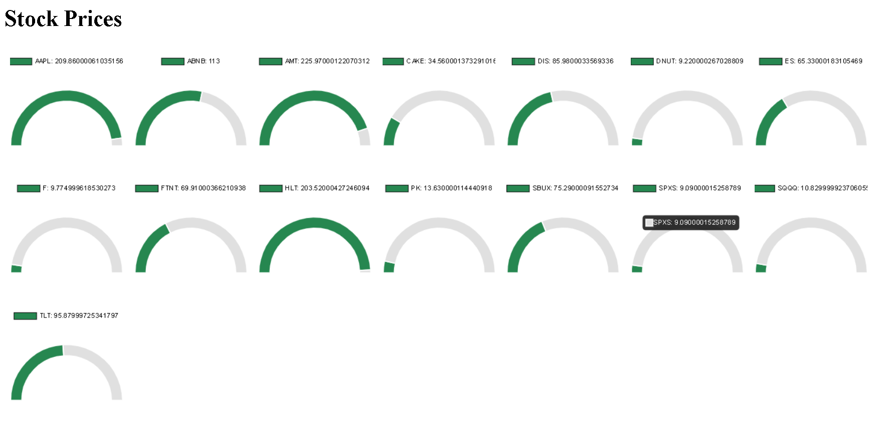

# Price Gauge Monitor

Deploys a web page that helps visualize a list of stock ticker prices.

## Installation

This is a simple flask app, so it is very easy to run.

```bash
# Clone the repository
git clone https://github.com/Photon1c/PriceGaugeMonitor.git

# Navigate to the project directory
cd PriceGaugeMonitor

#Run the app (requires Flask and Pandas)
Python app.py
'''

